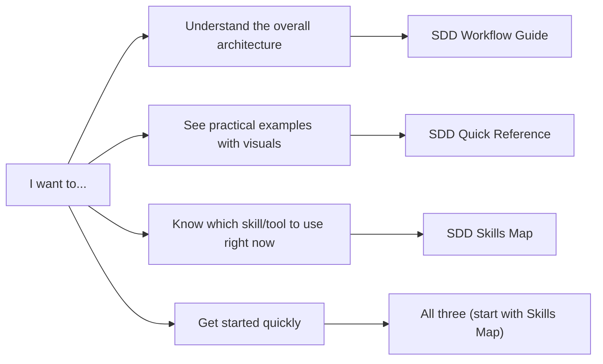

# Documentation

This directory contains comprehensive guides for integrating agent skills and MCP tools with GitHub's Spec-Kit for Spec-Driven Development.

---

## 📚 Available Guides

### Setup & Configuration

| Guide | Description |
|-------|-------------|
| [Agent Settings](./agent-settings.md) | Central config guide: skills, MCPs, supported AI assistants |
| [Skills Management](./skills.md) | Import, symlink, and manage skills across agents |
| [MCP Setup](./agent-settings.md) | MCP server setup via install skills |

### Skills Reference

**Tools** (atomic, single-purpose):
- [setup-project-config](./tools/setup-project-config.md) — One-time codebase scan + Atlassian config
- [generate-pr-notes](./tools/generate-pr-notes.md) — Auto-generate pull request descriptions
- [git-commit-conventional-strict](./tools/git-commit-conventional-strict.md) — Strict Conventional Commits with gitmoji
- [symlink-worktree-ignored-files](./tools/symlink-worktree-ignored-files.md) — Symlink git-ignored files to another worktree

**Workflows** (multi-step, orchestrated pipelines):
- [tech-plan-to-ticket](./workflows/tech-plan-to-ticket.md) — Create Jira tickets from a Confluence design review
- [sdd-qa-to-ticket](./workflows/sdd-qa-to-ticket.md) — Derive BDD QA scenarios and create Jira QA sub-tickets

---

### SDD Guides

### [SDD Workflow Guide](./sdd-workflow-spec-kit-native.md)
**Comprehensive overview with detailed architecture**

The complete guide to understanding how your agent skills and MCP tools integrate with GitHub's Spec-Kit. Includes:
- Full workflow architecture with Mermaid diagrams
- Integration points for each SDD phase
- Detailed skill and MCP tool usage
- Complete cycle examples
- Benefits and traceability
- Getting started instructions

**Best for:** Understanding the complete picture and architecture decisions.

---

### [SDD Quick Reference](./sdd-quick-reference.md)
**Fast visual guide with examples**

A scannable reference showing the SDD workflow with ASCII diagrams and real-world examples. Includes:
- Visual SDD cycle representation
- Integration map with all phases
- Skill usage by phase table
- Data flow diagram
- Step-by-step example walkthrough
- Key integration points
- Quick start commands

**Best for:** Quick lookups and understanding the flow with practical examples.

---

### [SDD Skills Map](./sdd-skills-map.md)
**Simple mapping reference**

The simplest guide showing exactly which skills and MCP tools to use at each phase. Includes:
- Complete cycle diagram
- Skill invocation commands
- Phase-skill matrix
- Decision tree for tool selection
- Real-world scenario walkthrough
- Status indicators
- Quick reference cheat sheet

**Best for:** When you just need to know "which skill do I use here?"

---

## 🎯 Which Guide Should I Use?

---

## 🚀 Quick Start Path

**New to SDD with agent skills?** Follow this reading order:

1. **[SDD Skills Map](./sdd-skills-map.md)** (5 min)
   - Get familiar with the cycle and tools

2. **[SDD Quick Reference](./sdd-quick-reference.md)** (10 min)
   - See practical examples and data flow

3. **[SDD Workflow Guide](./sdd-workflow-spec-kit-native.md)** (20 min)
   - Understand the complete architecture

---

## 📖 SDD Phases Overview

All three guides cover these nine phases of Spec-Driven Development (spec-kit native workflow):

### 1. Constitution
Define project standards, architecture, and conventions.

**Skills:** `symlink-worktree-ignored-files`
**MCP:** Atlassian (Confluence)

---

### 0. Pre-Specify (optional)
PO hands off a Confluence PRD. RD imports it as a local source file for spec-kit.

**Skills:** `prd-to-sdd-spec`
**MCP:** Atlassian (Confluence)

---

### 2. Specify
RD runs `spec-kit specify` for an AI-assisted discussion. Produces `spec.md` locally.

**CLI:** `spec-kit specify`

---

### 3. Plan
RD runs `spec-kit plan` for AI-assisted technical planning. Produces `plan.md` and `requirements.md` locally.

**CLI:** `spec-kit plan`

---

### 4. Review Loop
Publish local spec-kit files to Confluence as a design review page. Team comments; RD refines locally and re-publishes. Repeats until consensus.

**Skills:** `tech-plan-to-wiki`
**MCP:** Atlassian (Confluence)

---

### 5. Plan Finalized
RD marks the Confluence design review page as Approved (v1). Plan is locked.

**Skills:** `tech-plan-to-wiki` (status update)
**MCP:** Atlassian (Confluence)

---

### 6. Tasks
Create Jira root ticket + subtasks from the approved Confluence page.

**Skills:** `tech-plan-to-ticket`
**MCP:** Atlassian (Jira)

---

### 7. Implement & PR
Implement code, commit semantically, document the API, and open a pull request. The open PR is the explicit exit condition for this phase.

**Skills:**
- `git-commit-conventional-strict` (semantic commits)
- `sync-api-spec` (API spec + optional Confluence publish)
- `generate-pr-notes` (pull request)

**MCP:** Atlassian (Jira)

---

### 8. QA Gate
RD makes a conscious hand-off decision after the PR is open. Agent derives BDD scenarios from all spec-kit `*.md` files and creates QA sub-tickets under the existing root Jira ticket. SDET owns execution method and order.

**Skills:** `sdd-qa-to-ticket`
**MCP:** Atlassian (Jira)

---

### 9. Iterate
New requirements or bugs loop back to the appropriate phase (Specify, Plan, or Tasks).

**MCP:** Atlassian (Jira + Confluence sync), claude-mem

---

## 🛠️ Tools Reference

### Agent Skills

| Skill | Purpose | Used In Phases |
|-------|---------|---------------|
| `symlink-worktree-ignored-files` | Setup dev environment with worktrees | Constitution |
| `prd-to-sdd-spec` | Fetch Confluence PRD → local `prd-source.md` | Pre-Specify |
| `tech-plan-to-wiki` | Publish local spec-kit files to Confluence design review page | Review Loop, Plan Finalized |
| `tech-plan-to-ticket` | Create Jira root ticket + subtasks from approved Confluence page | Tasks |
| `git-commit-conventional-strict` | Semantic version commits | Implement & PR |
| `sync-api-spec` | Maintain `docs/agents/api-spec.md` + optional Confluence publish | Implement & PR |
| `generate-pr-notes` | Create pull request (phase exit condition) | Implement & PR |
| `sdd-qa-to-ticket` | RD hand-off: derive BDD scenarios → Jira QA sub-tickets for SDET | QA Gate |

### MCP Tools

| MCP | Purpose | Used In Phases |
|-----|---------|---------------|
| Atlassian (Confluence) | Spec and doc storage | Constitution, Specify, Plan, Iterate |
| Atlassian (Jira) | Task management | Tasks, Iterate |
| claude-mem | Context and learning | Specify, Plan, Tasks, Iterate |

---

## 🔗 External Resources

### GitHub Spec-Kit
- [GitHub Spec-Kit Repository](https://github.com/github/spec-kit)
- [Spec-Driven Development Guide](https://github.com/github/spec-kit/blob/main/spec-driven.md)
- [Getting Started with Spec-Kit](https://github.blog/ai-and-ml/generative-ai/spec-driven-development-with-ai-get-started-with-a-new-open-source-toolkit/)

### Background Reading
- [Microsoft: Diving Into Spec-Driven Development](https://developer.microsoft.com/blog/spec-driven-development-spec-kit)
- [Martin Fowler: Understanding Spec-Driven-Development](https://martinfowler.com/articles/exploring-gen-ai/sdd-3-tools.html)

### Project Resources
- [Agent Skills Main README](../README.md)
- [Skills Management Guide](./skills.md)
- [Skills Management Guide](./skills.md)
- [Agent Settings Guide](./agent-settings.md)

---

## 💡 Contributing

Found an issue or have suggestions for improving these guides?

1. Open an issue describing the problem or enhancement
2. Submit a PR with documentation improvements
3. Share your SDD workflow experiences

---

## 📝 License

These documentation files are part of the agent-skills project. See [LICENSE](../LICENSE) for details.
