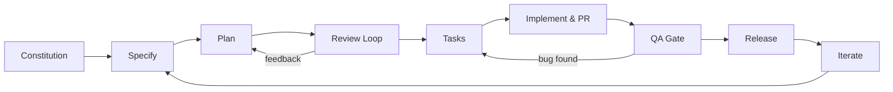
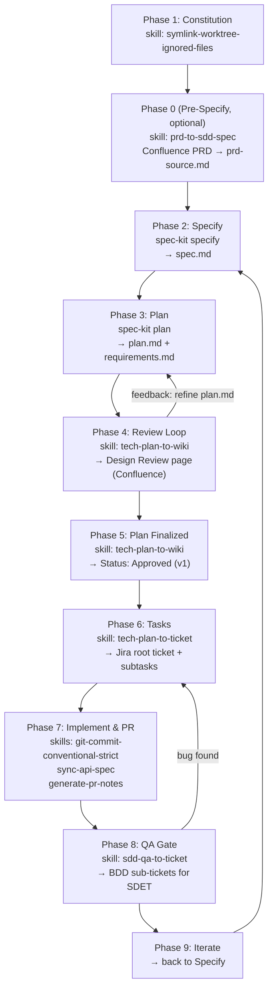

# SDD Quick Reference: Agent Skills Integration

A quick visual guide showing how your agent skills integrate with GitHub Spec-Kit's spec-kit native SDD workflow.

---

## The SDD Cycle



---

## Workflow Phases & Skills



---

## Skill Usage by Phase

| Phase | Command | Purpose |
|-------|---------|---------|
| **Constitution** | `/symlink-worktree-ignored-files` | Set up dev environment with worktrees |
| **Pre-Specify (optional)** | `/prd-to-sdd-spec` | Fetch Confluence PRD → local `prd-source.md` |
| **Specify** | `spec-kit specify` | AI-assisted discussion → `spec.md` |
| **Plan** | `spec-kit plan` | AI technical planning → `plan.md` + `requirements.md` |
| **Review Loop (first publish)** | `/tech-plan-to-wiki` | Publish local files to Confluence design review page |
| **Review Loop (re-publish)** | `/tech-plan-to-wiki [page-id]` | Update page after refining plan based on feedback |
| **Plan Finalized** | `/tech-plan-to-wiki [page-id]` | Set status to Approved (v1) |
| **Tasks** | `/tech-plan-to-ticket [page-id]` | Create Jira root ticket + subtasks from approved page |
| **Implement & PR** | `/git-commit-conventional-strict` | Semantic version commits |
| **Implement & PR** | `/sync-api-spec` | Maintain `docs/agents/api-spec.md` (optional Confluence publish) |
| **Implement & PR** | `/generate-pr-notes` | Create pull request (phase exit condition) |
| **QA Gate** | `/sdd-qa-to-ticket [root-ticket-key]` | RD explicit hand-off → BDD QA sub-tickets in Jira |

---

## Data Flow

```mermaid
graph LR
    LocalFiles["Local spec-kit files
    spec.md / plan.md / requirements.md"]

    Confluence["Confluence
    Design Review Page"]

    Jira["Jira
    Root ticket + impl subtasks"]

    PR["Pull Request"]

    JiraQA["Jira
    QA sub-tickets (BDD)"]

    SDET["SDET
    Owns execution method"]

    JiraBug["Jira
    Bug ticket → back to Tasks"]

    LocalFiles -->|"tech-plan-to-wiki"| Confluence
    Confluence -->|"tech-plan-to-ticket"| Jira
    Jira -->|"implement & PR"| PR
    PR -->|"sdd-qa-to-ticket"| JiraQA
    JiraQA --> SDET
    SDET -->|"bug found"| JiraBug
    JiraBug --> Jira
```



---

## Example: Notification Service Refactor

### Phase 1: Constitution

Review architecture standards in Confluence. Set up dev environment.

```bash
/symlink-worktree-ignored-files
```

### Phase 0 (Pre-Specify, optional)

PO hands off PRD from Confluence. RD imports it locally.

```bash
/prd-to-sdd-spec
# Fetches Confluence PRD → saves as prd-source.md
```

### Phase 2: Specify

```bash
spec-kit specify
# AI discussion with RD about notification system requirements
# Output: spec.md
# Contains: problem statement (legacy push service is unreliable, no retry logic),
#           goals, constraints
```

### Phase 3: Plan

```bash
spec-kit plan
# AI technical planning session
# Output: plan.md + requirements.md
# plan.md proposes: event-driven architecture with SQS, retry strategy, DLQ
# requirements.md lists: delivery guarantees, retry count, observability
```

### Phase 4 (First Publish — Review Loop)

```bash
/tech-plan-to-wiki
# Agent publishes spec.md + plan.md + requirements.md to Confluence
# Output: Design Review page (Status: Draft)
# Save the returned page ID: 987654321
```

Team reviews and adds three comments:
1. "Why not use an existing queue service instead of rolling our own?"
2. "What's the max retry count? Not specified."
3. "The dead-letter queue handling is unclear."

### Phase 4 (Review Iteration 1)

```bash
spec-kit plan
# RD incorporates feedback: queue options comparison, max retry=5, DLQ clarification

/tech-plan-to-wiki 987654321
# Agent updates page + appends revision history row
# v2 | 2026-03-04 | RD | Added queue options comparison, max retry=5, DLQ clarification
```

Team reviews v2. One comment remains: "Can we see the SQS cost estimate?"

### Phase 4 (Review Iteration 2)

```bash
spec-kit plan
# RD adds cost analysis note to plan.md

/tech-plan-to-wiki 987654321
# v3 | 2026-03-05 | RD | Added cost analysis reference for SQS option
# Team reaches consensus: go with SQS
```

### Phase 5: Plan Finalized

```bash
/tech-plan-to-wiki 987654321
# Ask agent: "Update the status to Approved (v1)"
# Page status: Approved (v1) — plan locked
```

### Phase 6: Tasks

```bash
/tech-plan-to-ticket 987654321
# Creates:
# NOTIF-101: [PROJECT][NOTIFICATIONS] Notification Service Refactor (root)
# NOTIF-102: [RD] Set up SQS queue and IAM roles
# NOTIF-103: [RD] Implement notification producer
# NOTIF-104: [RD] Implement consumer with retry logic
# NOTIF-105: [RD] Implement DLQ handler and alerts
```

### Phase 7: Implement & PR

```bash
# Implement NOTIF-103
/git-commit-conventional-strict
# → feat(notifications): add notification producer with SQS

/sync-api-spec
# → docs/agents/api-spec.md updated with notification endpoint

/generate-pr-notes
# → PR #456 "Add notification producer"
# Phase exit condition: PR is open
```

### Phase 8: QA Gate

RD reviews PR #456, confirms implementation is ready for QA, then explicitly triggers the hand-off:

```bash
/sdd-qa-to-ticket NOTIF-101
```

Agent derives BDD scenarios from all `*.md` files in the spec-kit folder, presents them for RD review, then creates:

```
NOTIF-101 (root)
  ├── NOTIF-102 ... NOTIF-105  (existing impl sub-tickets)
  ├── NOTIF-106: [QA][NOTIFICATIONS] Successful notification delivery
  ├── NOTIF-107: [QA][NOTIFICATIONS] Retry on transient failure
  ├── NOTIF-108: [QA][NOTIFICATIONS] Dead-letter queue on exhausted retries
  └── NOTIF-109: [QA][NOTIFICATIONS] Duplicate prevention
```

SDET claims sub-tickets and owns execution method and order.

### Phase 9: Iterate

New requirement arrives. Cycle back to Specify.

---

## Key Points

| Concern | Detail |
|---------|--------|
| **Source of truth** | Local spec-kit files (`spec.md`, `plan.md`, `requirements.md`) |
| **Confluence role** | Shared review surface — team comments, does not edit |
| **Jira structure** | Root ticket + impl sub-tickets (Phase 6) + QA sub-tickets (Phase 8) |
| **QA hand-off** | RD explicit decision after PR is open — not automatic |
| **SDET owns** | Execution method, test order, and approach for BDD scenarios |

---

## Quick Start

```bash
# 1. Set up Atlassian MCP
/install-atlassian-mcp

# 2. Import skills
./.agent-settings/skills/import-skills.sh claude

# 3. Set up dev environment
/symlink-worktree-ignored-files

# 4. (Optional) Import PRD from Confluence
/prd-to-sdd-spec

# 5. Specify
spec-kit specify

# 6. Plan
spec-kit plan

# 7. Publish for review
/tech-plan-to-wiki

# 8. After team feedback — re-publish with page ID
/tech-plan-to-wiki [page-id]

# 9. Finalize plan
# /tech-plan-to-wiki [page-id]  (ask: "Update status to Approved (v1)")

# 10. Create Jira tickets
/tech-plan-to-ticket [page-id]

# 11. Implement & commit
/git-commit-conventional-strict

# 12. Update API spec
/sync-api-spec

# 13. Create PR (phase exit condition)
/generate-pr-notes

# 14. QA hand-off (after PR is open — RD explicit decision)
/sdd-qa-to-ticket [root-ticket-key]
```

---

## Resources

- [Full Workflow Guide](./sdd-workflow-spec-kit-native.md)
- [SDD Skills Map](./sdd-skills-map.md)
- [GitHub Spec-Kit](https://github.com/github/spec-kit)
- [Agent Skills README](../README.md)
- [Skills Management](../.agent-settings/skills/README.md)
