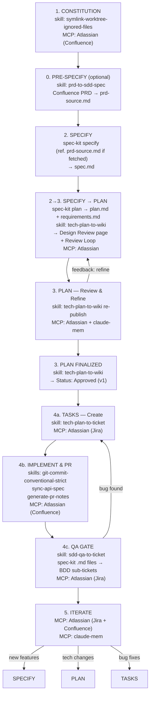

# SDD Skills & MCP Mapping

Visual reference showing exactly which skills and MCP tools to use at each SDD phase.

---

## 🔄 The Complete Cycle



---

## 📋 Skill Invocation Guide

### Constitution Phase
```bash
# Setup development environment
/symlink-worktree-ignored-files

# Store standards
# Use: MCP Atlassian to create Confluence pages
```

### Pre-Specify Phase (PO handoff)
```bash
# Import PO's Confluence PRD as a local source file for spec-kit
/prd-to-sdd-spec

# Fetches PRD from Confluence → Saves as prd-source.md
# RD then references prd-source.md when running spec-kit specify
```

### Specify Phase
```bash
# Run spec-kit with prd-source.md as context (spec-kit native)
spec-kit specify

# Or write spec directly in Confluence (Confluence-centric path)
# Use: MCP Atlassian → Create Confluence page
```

### Specify → Plan Transition
```bash
# Publish local spec-kit artifacts to Confluence for team review
/tech-plan-to-wiki

# Use: MCP Atlassian → Create/update Design Review page
```

### Plan Phase
```bash
# Re-publish if spec-kit files updated after team feedback
/tech-plan-to-wiki [page-id]

# Document architecture decisions
# Use: MCP Atlassian → Confluence
# Use: MCP claude-mem → Store decisions
```

### Tasks Phase
```bash
# Step 1: Create Jira tickets
/tech-plan-to-ticket

# Step 2: Implement code

# Step 3: Commit changes
/git-commit-conventional-strict

# Step 4: Generate API documentation from committed code
/generate-pr-notes

# Step 5: Create pull request (phase exit condition)
/generate-pr-notes
```

### QA Gate Phase (after PR is open)
```bash
# RD explicit hand-off decision — not automatic
/sdd-qa-to-ticket [root-ticket-key]

# Reads all *.md in spec-kit folder
# Derives BDD scenarios (happy paths, edge cases, error paths)
# Presents for RD review, then creates QA sub-tickets in Jira
# SDET owns execution method and order
```

### Iterate Phase
```bash
# Sync status across tools
# Use: MCP Atlassian → Update Jira & Confluence

# Record learnings
# Use: MCP claude-mem → Store context
```

---

## 🎯 Phase-Skill Matrix

| SDD Phase | Primary Tool | Purpose | Output |
|-----------|-------------|---------|---------|
| **Constitution** | `symlink-worktree-ignored-files` | Environment setup | Dev environment ready |
| **Constitution** | Atlassian MCP | Document standards | Confluence pages |
| **Pre-Specify (PO handoff)** | `prd-to-sdd-spec` | Fetch PO's Confluence PRD → local `prd-source.md` for spec-kit | `prd-source.md` (local) |
| **Specify** | Atlassian MCP + claude-mem | Write spec & remember | Confluence pages + Context |
| **Specify → Plan (spec-kit native)** | `tech-plan-to-wiki` | Publish local spec-kit files to Confluence for team review | Design Review page in Confluence |
| **Plan** | Atlassian MCP + claude-mem | Document & track | Plans + Decisions |
| **Tasks** | `tech-plan-to-ticket` | Task creation | Jira tickets |
| **Tasks** | `git-commit-conventional-strict` | Version control | Semantic commits |
| **Tasks** | `sync-api-spec` | Document implemented API | `docs/agents/api-spec.md` + optional Confluence |
| **Tasks** | `generate-pr-notes` | PR documentation | Pull request notes |
| **QA Gate** | `sdd-qa-to-ticket` | QA hand-off after PR — BDD scenarios → Jira sub-tickets | QA sub-tickets under existing root ticket |
| **Iterate** | Atlassian MCP | Sync status | Updated tickets/docs |
| **Iterate** | claude-mem MCP | Learn & improve | Stored context |

---

## 🔍 Decision Tree: Which Tool to Use?

```
Need to... ?
│
├─> Set up development environment?
│   └─> Use: /symlink-worktree-ignored-files
│
├─> Import a PO's Confluence PRD as a local spec-kit source file?
│   └─> Use: /prd-to-sdd-spec
│
├─> Publish spec-kit local artifacts to Confluence for team review?
│   └─> Use: /tech-plan-to-wiki
│
├─> Create work tickets from specs?
│   └─> Use: /tech-plan-to-ticket
│
├─> Document API from implemented code?
│   └─> Use: /sync-api-spec
│
├─> Commit code changes?
│   └─> Use: /git-commit-conventional-strict
│
├─> Create a pull request?
│   └─> Use: /generate-pr-notes
│
├─> Hand off implementation to SDET for QA (after PR)?
│   └─> Use: /sdd-qa-to-ticket [root-ticket-key]
│
├─> Store/retrieve documentation?
│   └─> Use: MCP Atlassian (Confluence)
│
├─> Manage tasks/tickets?
│   └─> Use: MCP Atlassian (Jira)
│
└─> Remember context/decisions?
    └─> Use: MCP claude-mem
```

---

## 💼 Real-World Example

**Task:** Add user authentication feature

```
┏━━━━━━━━━━━━━━━━━━━━━━━━━━━━━━━━━━━━━━━━━━━━━━━━━━━━━━━━━━━━┓
┃  Phase 1: CONSTITUTION                                       ┃
┗━━━━━━━━━━━━━━━━━━━━━━━━━━━━━━━━━━━━━━━━━━━━━━━━━━━━━━━━━━━━┛

  Action: Review security standards
  Tool:   MCP Atlassian
  Query:  "Show me authentication standards from Confluence"
  Result: Retrieved coding standards for auth


┏━━━━━━━━━━━━━━━━━━━━━━━━━━━━━━━━━━━━━━━━━━━━━━━━━━━━━━━━━━━━┓
┃  Phase 2: SPECIFY                                            ┃
┗━━━━━━━━━━━━━━━━━━━━━━━━━━━━━━━━━━━━━━━━━━━━━━━━━━━━━━━━━━━━┛

  Action: Define authentication requirements
  Tool:   MCP Atlassian
  Input:  Requirements doc
  Result: Confluence page "Auth Specification v1"
          Page ID: 123456789


┏━━━━━━━━━━━━━━━━━━━━━━━━━━━━━━━━━━━━━━━━━━━━━━━━━━━━━━━━━━━━┓
┃  Phase 2→3: SPECIFY → PLAN                                   ┃
┗━━━━━━━━━━━━━━━━━━━━━━━━━━━━━━━━━━━━━━━━━━━━━━━━━━━━━━━━━━━━┛

  Action: Generate Tech Design Document from the spec
  Tool:   /prd-to-sdd-spec
  Input:  Confluence page "Auth Specification v1" (ID: 123456789)
  Result: Tech Design Document in Confluence
          • Architecture: JWT + refresh token strategy
          • Components: AuthService, TokenStore, Middleware
          • DB changes: user_sessions table
          • Implementation plan: 3 phases


┏━━━━━━━━━━━━━━━━━━━━━━━━━━━━━━━━━━━━━━━━━━━━━━━━━━━━━━━━━━━━┓
┃  Phase 3: PLAN                                               ┃
┗━━━━━━━━━━━━━━━━━━━━━━━━━━━━━━━━━━━━━━━━━━━━━━━━━━━━━━━━━━━━┛

  Action: Refine TDD based on team review
  Tool:   MCP Atlassian + claude-mem
  Result: Finalized Tech Design Document in Confluence


┏━━━━━━━━━━━━━━━━━━━━━━━━━━━━━━━━━━━━━━━━━━━━━━━━━━━━━━━━━━━━┓
┃  Phase 4: TASKS                                              ┃
┗━━━━━━━━━━━━━━━━━━━━━━━━━━━━━━━━━━━━━━━━━━━━━━━━━━━━━━━━━━━━┛

  Step 4a: Create Tasks
    Tool:   /tech-plan-to-ticket
    Input:  Confluence page ID: 123456789
    Result: Created Jira tickets
            • AUTH-101: Implement JWT generation
            • AUTH-102: Add auth middleware
            • AUTH-103: Write integration tests

  Step 4b: Implement AUTH-101
    Tool:   (Manual coding)
    Result: Implemented JWT generation

  Step 4c: Commit Changes
    Tool:   /git-commit-conventional-strict
    Result: feat(auth): ✨ add JWT token generation

  Step 4d: Document API
    Tool:   /sync-api-spec
    Result: docs/agents/api-spec.md updated with JWT endpoint

  Step 4e: Create PR
    Tool:   /generate-pr-notes
    Result: PR #789 "Add JWT Authentication"
            • Summary: 3 files changed
            • Links to AUTH-101, AUTH-102, AUTH-103
            • Test plan included


┏━━━━━━━━━━━━━━━━━━━━━━━━━━━━━━━━━━━━━━━━━━━━━━━━━━━━━━━━━━━━┓
┃  Phase 5: ITERATE                                            ┃
┗━━━━━━━━━━━━━━━━━━━━━━━━━━━━━━━━━━━━━━━━━━━━━━━━━━━━━━━━━━━━┛

  Action: Update Jira status
  Tool:   MCP Atlassian
  Result: AUTH-101: Done
          AUTH-102: In Progress
          AUTH-103: To Do

  Action: Document learnings
  Tool:   MCP Atlassian
  Input:  "Learned: RS256 requires key pair management"
  Result: Added to Confluence "Auth Lessons Learned"

  Action: Store decision
  Tool:   MCP claude-mem
  Input:  "Decision: Use RS256 over HS256 for better security"
  Result: Context stored for future auth work

  Next: Bug reported → Go back to TASKS for fix
```

---

## 🚦 Status Indicators

Use these to track your progress through the SDD cycle:

```
□ Constitution: Standards documented
  └─> Tools ready: symlink-worktree-ignored-files, Atlassian MCP

□ Specify: Requirements defined
  └─> Specs via: Atlassian MCP

□ Plan: Technical approach documented
  └─> Plans published: tech-plan-to-wiki, Atlassian MCP

□ Implement: API documented
  └─> API spec updated: sync-api-spec

□ Tasks: Work broken down and assigned
  └─> Tickets created: tech-plan-to-ticket, Atlassian MCP

□ Implement: Code written and committed
  └─> Commits made: git-commit-conventional-strict

□ PR: Changes documented and submitted
  └─> PR created: generate-pr-notes

□ QA Gate: QA hand-off complete (RD deliberate decision after PR)
  └─> QA sub-tickets created: sdd-qa-to-ticket

□ Iterate: Status synced and learnings captured
  └─> Context stored: Atlassian MCP, claude-mem
```

---

## 📖 Quick Reference Card

**1. CONSTITUTION**
- `/symlink-worktree-ignored-files`
- MCP: Atlassian (Confluence)

**PRE-SPECIFY (PO handoff — optional)**
- `/prd-to-sdd-spec`
- Confluence PRD → local `prd-source.md`

**2. SPECIFY**
- `spec-kit specify` (reference `prd-source.md`)
- MCP: Atlassian (Confluence) + claude-mem

**2→3. SPECIFY → PLAN (spec-kit native)**
- `/tech-plan-to-wiki`
- MCP: Atlassian (Confluence)

**3. PLAN — Review Loop (re-publish after feedback)**
- `/tech-plan-to-wiki [page-id]`
- MCP: Atlassian (Confluence) + claude-mem

**3. PLAN FINALIZED**
- `/tech-plan-to-wiki [page-id]` → ask: "Update status to Approved (v1)"

**4. TASKS — Create tickets**
- `/tech-plan-to-ticket [page-id]`
- MCP: Atlassian (Jira)

**4. TASKS — Implement & PR**
- implement code
- `/git-commit-conventional-strict`
- `/sync-api-spec` (update API spec)
- `/generate-pr-notes` (phase exit condition)
- MCP: Atlassian (Jira) + claude-mem

**4c. QA GATE (after PR — RD explicit decision)**
- `/sdd-qa-to-ticket [root-ticket-key]`
- MCP: Atlassian (Jira)

**5. ITERATE**
- MCP: Atlassian (Jira + Confluence)
- MCP: claude-mem

---

## 🔗 Related Documentation

- [Detailed Workflow Guide](./sdd-workflow-spec-kit-native.md)
- [Quick Reference with Examples](./sdd-quick-reference.md)
- [Agent Skills README](../README.md)
- [Skills Management](../.agent-settings/skills/README.md)
