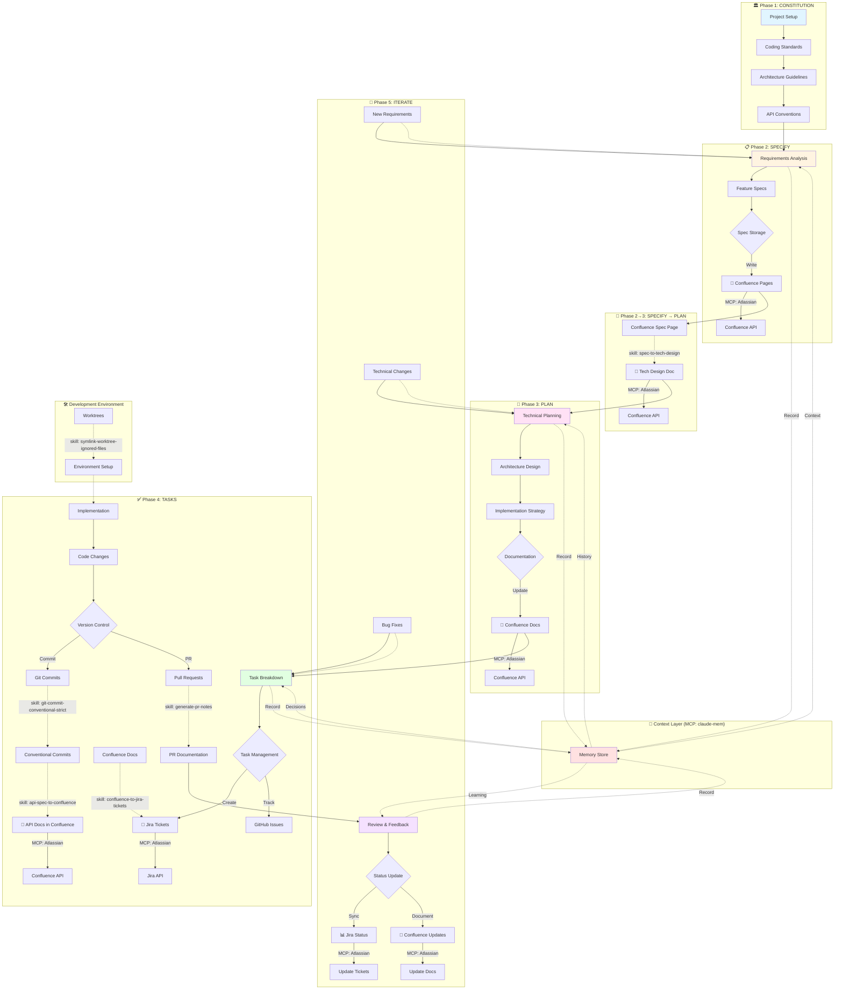
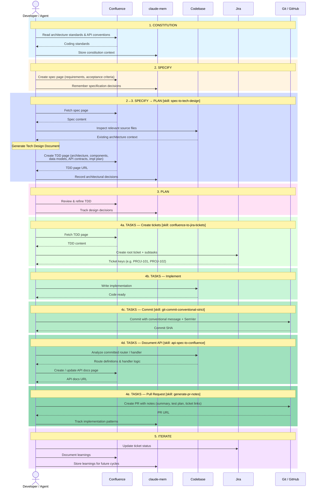

# SDD Workflow Integration with Agent Skills & MCP Tools

This document illustrates how agent-skills and MCP tools integrate with GitHub's Spec-Kit for Spec-Driven Development (SDD).

## Overview

**Spec-Driven Development Flow:** Constitution → 𝄆 Specify → Plan → Tasks 𝄇

The workflow creates a cycle where specifications drive implementation, with AI agents executing tasks based on well-defined specs and plans.

---

## Integration Architecture Diagram



---

## Sequence Diagram



---

## Integration Points by Phase

### 1. Constitution Phase
**Purpose:** Establish project foundations and standards

**Integration:**
- Document architecture guidelines in Confluence
- Define API conventions and patterns
- Set up development environment

**Skills Used:**
- `symlink-worktree-ignored-files` - Environment setup for multiple worktrees

**MCP Tools:**
- `Atlassian MCP` - Store constitution docs in Confluence

---

### 2. Specify Phase
**Purpose:** Define what needs to be built

**Integration:**
- Write feature specifications
- Store specs in Confluence for team access

**Skills Used:**
- *(none — specs are written directly in Confluence via MCP)*

**MCP Tools:**
- `Atlassian MCP` - Create/update Confluence pages
- `claude-mem` - Remember specification decisions and patterns

**Workflow:**
```
Requirements → Write Spec → Store in Confluence
```

---

### 2→3. Specify → Plan Transition
**Purpose:** Translate the feature spec into a structured Technical Design Document before planning begins

**Integration:**
- Read the approved spec page from Confluence
- Analyze requirements, affected components, and constraints
- Generate a full Tech Design Document (TDD) and publish it to Confluence

**Skills Used:**
- `spec-to-tech-design` - Reads a Confluence spec and produces a TDD covering architecture, components, data models, API contracts, security, testing strategy, and phased implementation plan

**MCP Tools:**
- `Atlassian MCP` - Fetch spec page, create/update TDD page

**Workflow:**
```
Confluence Spec → spec-to-tech-design → Tech Design Doc → Confluence (TDD page)
```

---

### 3. Plan Phase
**Purpose:** Create technical implementation strategy

**Integration:**
- Design architecture based on the TDD produced at the Specify→Plan transition
- Refine and update the TDD as decisions are finalized
- Link plans to specifications

**Skills Used:**
- `spec-to-tech-design` - Re-run to update the TDD if the spec changes

**MCP Tools:**
- `Atlassian MCP` - Update Confluence with technical plans
- `claude-mem` - Track architectural decisions

**Workflow:**
```
Spec → Tech Design Doc (TDD) → Refined Plan → Confluence
```

---

### 4. Tasks Phase
**Purpose:** Break down and execute work

**Integration:**
- Convert plans into actionable tasks
- Create Jira tickets from Confluence docs
- Implement with proper version control
- Document changes in PRs

**Skills Used:**
- `confluence-to-jira-tickets` - Create Jira tickets from Confluence documentation
- `git-commit-conventional-strict` - Structured, semantic commits with SemVer
- `generate-pr-notes` - Comprehensive PR documentation
- `api-spec-to-confluence` - Generate API documentation from the implemented code

**MCP Tools:**
- `Atlassian MCP` - Create/update Jira tickets, publish API docs
- `claude-mem` - Track implementation decisions and patterns

**Workflow:**
```
Confluence TDD → Jira Tickets → Implement Code → Git Commits → API Docs → Pull Request
              ↓                      ↓                ↓              ↓            ↓
  confluence-to-jira-tickets       Code        git-commit  api-spec-to-confluence  generate-pr-notes
```

---

### 5. Iterate Phase
**Purpose:** Review, learn, and improve

**Integration:**
- Update task status in Jira
- Document learnings in Confluence
- Feed insights back into specs/plans

**MCP Tools:**
- `Atlassian MCP` - Sync status across Jira and Confluence
- `claude-mem` - Learn from iterations and improve future cycles

**Workflow:**
```
Review → Update Status → Document Learnings → Next Iteration
   ↓          ↓                ↓                    ↓
 Jira    Atlassian MCP    Confluence          New Specs/Plans
```

---

## Complete Cycle Example

### Scenario: Adding a New API Endpoint

```
┌─────────────────────────────────────────────────────────────────┐
│ 1. CONSTITUTION: Review API conventions in Confluence          │
│    └─> MCP: Atlassian (Read existing standards)                │
└─────────────────────────────────────────────────────────────────┘
                              ↓
┌─────────────────────────────────────────────────────────────────┐
│ 2. SPECIFY: Define new endpoint requirements                    │
│    └─> Write spec in Confluence                                 │
│    └─> MCP: Atlassian (Create Confluence page)                  │
└─────────────────────────────────────────────────────────────────┘
                              ↓
┌─────────────────────────────────────────────────────────────────┐
│ 2→3. SPECIFY → PLAN: Generate Technical Design Document         │
│    └─> Skill: spec-to-tech-design (Read spec → Create TDD)      │
│    └─> MCP: Atlassian (Create TDD page in Confluence)           │
└─────────────────────────────────────────────────────────────────┘
                              ↓
┌─────────────────────────────────────────────────────────────────┐
│ 3. PLAN: Design implementation approach                         │
│    └─> Review and refine TDD                                    │
│    └─> MCP: Atlassian (Update Confluence)                       │
└─────────────────────────────────────────────────────────────────┘
                              ↓
┌─────────────────────────────────────────────────────────────────┐
│ 4. TASKS: Execute implementation                                │
│    ├─> Skill: confluence-to-jira-tickets (Create Jira tasks)    │
│    │   └─> MCP: Atlassian (Create Jira tickets)                 │
│    ├─> Implement code in worktree                               │
│    │   └─> Skill: symlink-worktree-ignored-files (Setup env)    │
│    ├─> Commit changes                                           │
│    │   └─> Skill: git-commit-conventional-strict (SemVer)       │
│    ├─> Generate API docs from committed code                    │
│    │   └─> Skill: api-spec-to-confluence (Publish to Confluence)│
│    └─> Create PR                                                │
│        └─> Skill: generate-pr-notes (PR documentation)          │
└─────────────────────────────────────────────────────────────────┘
                              ↓
┌─────────────────────────────────────────────────────────────────┐
│ 5. ITERATE: Review and refine                                   │
│    ├─> Update Jira ticket status                                │
│    │   └─> MCP: Atlassian (Update Jira)                         │
│    ├─> Document learnings in Confluence                         │
│    │   └─> MCP: Atlassian (Update Confluence)                   │
│    └─> Record decisions                                         │
│        └─> MCP: claude-mem (Store context)                      │
└─────────────────────────────────────────────────────────────────┘
```

---

## Skill Mapping Matrix

| Phase | GitHub Spec-Kit Action | Agent Skill | MCP Tool | Output |
|-------|----------------------|-------------|----------|---------|
| **Constitution** | Setup project standards | symlink-worktree-ignored-files | Atlassian | Environment ready |
| **Specify** | Write specifications | *(MCP direct)* | Atlassian | Confluence pages |
| **Specify → Plan** | Generate tech design | spec-to-tech-design | Atlassian | Tech Design Doc in Confluence |
| **Plan** | Refine technical plans | spec-to-tech-design | Atlassian | Updated TDD |
| **Tasks** | Generate API docs from code | api-spec-to-confluence | Atlassian | API documentation in Confluence |
| **Tasks** | Create work items | confluence-to-jira-tickets | Atlassian | Jira tickets |
| **Tasks** | Implement code | - | claude-mem | Code changes |
| **Tasks** | Version control | git-commit-conventional-strict | - | Git commits |
| **Tasks** | Document changes | generate-pr-notes | - | Pull requests |
| **Iterate** | Sync status | - | Atlassian | Updated tickets |
| **Iterate** | Record learnings | - | claude-mem | Context memory |

---

## Benefits of This Integration

### 🎯 Traceability
- Requirements → Specs → Plans → Tasks → Code → PRs
- Every change traces back to a specification
- Bidirectional links between Confluence and Jira

### 🤖 Automation
- Auto-generate API documentation from code
- Convert specs to actionable Jira tickets
- Structured commits with semantic versioning
- Comprehensive PR notes generation

### 🧠 Contextual Intelligence
- claude-mem MCP retains decisions and patterns
- Consistent approach across iterations
- Learning from past implementations

### 📊 Visibility
- Confluence as single source of truth for specs
- Jira for task tracking and progress
- GitHub for code and PR documentation
- Integrated view across all platforms

### 🔄 Iteration-Friendly
- Easy to update specs and regenerate docs
- Sync changes across Confluence, Jira, and GitHub
- Maintain consistency during iterations

---

## Getting Started

### 1. Install GitHub Spec-Kit
```bash
npm install -g @github/specify-cli
specify init
```

### 2. Set Up MCP Integration
```bash
# Install Atlassian MCP
./.agent-settings/mcps/install-atlassian-mcp.sh --agent claude

# Configure credentials in .env.mcp-atlassian
```

### 3. Import Agent Skills
```bash
# For Claude Code (skills are symlinked)
./.agent-settings/skills/import-skills.sh claude

# For Gemini CLI
./.agent-settings/skills/import-skills.sh gemini
```

### 4. Start Your First SDD Cycle
```bash
# 1. Constitution: Document standards in Confluence
# 2. Specify: Write feature spec
# 3. Plan: Use /api-spec-to-confluence skill
# 4. Tasks: Use /confluence-to-jira-tickets skill
# 5. Implement: Use /git-commit-conventional-strict
# 6. PR: Use /generate-pr-notes
```

---

## References

- [GitHub Spec-Kit Repository](https://github.com/github/spec-kit)
- [Spec-Driven Development Guide](https://github.com/github/spec-kit/blob/main/spec-driven.md)
- [Microsoft Developer Blog: Diving Into Spec-Driven Development](https://developer.microsoft.com/blog/spec-driven-development-spec-kit)
- [Martin Fowler: Understanding Spec-Driven-Development](https://martinfowler.com/articles/exploring-gen-ai/sdd-3-tools.html)
- [GitHub Blog: Spec-driven development with AI](https://github.blog/ai-and-ml/generative-ai/spec-driven-development-with-ai-get-started-with-a-new-open-source-toolkit/)

---

## License

See [LICENSE](../LICENSE) file for details.
