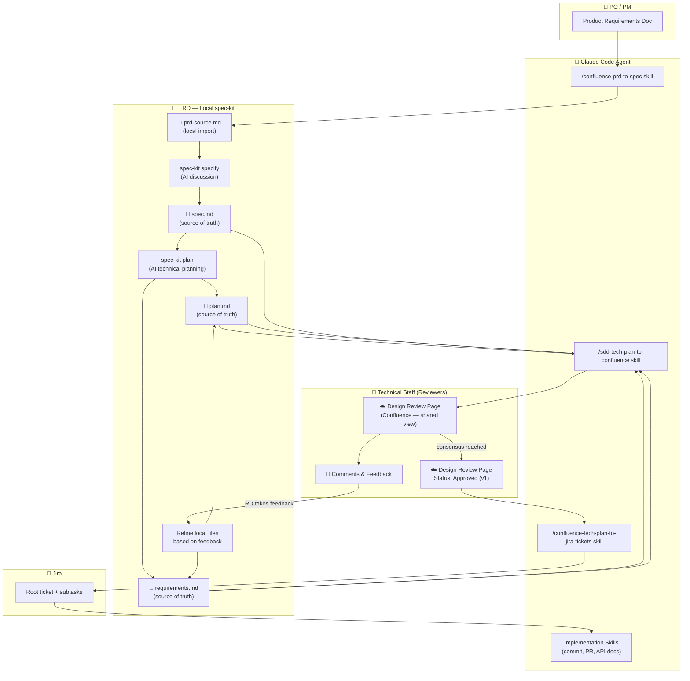
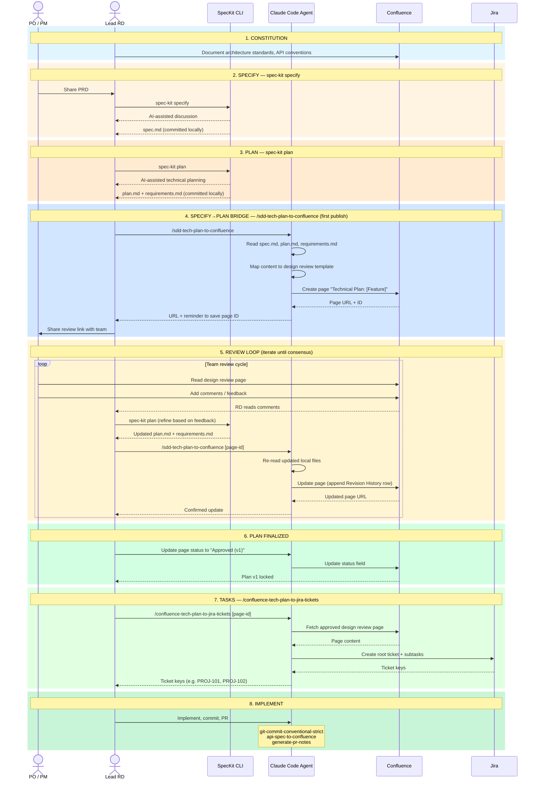

# SDD Workflow: Spec-Kit Native Path

This document describes the **spec-kit native** variant of the SDD workflow, where spec-kit CLI handles all AI-assisted phases locally and Confluence is used as a **shared review surface** — not the source of truth.

> This is the canonical SDD workflow document covering the spec-kit native path where local files are the source of truth.

---

## Overview

| Concern | Owner |
|---------|-------|
| **Source of truth** | Local spec-kit files (`spec.md`, `plan.md`, `requirements.md`) |
| **AI discussion phases** | spec-kit CLI (runs locally with the RD) |
| **Shared review surface** | Confluence (published by agent skills) |
| **Team feedback channel** | Confluence comments → RD refines local files → re-publishes |
| **Task tracking** | Jira (created from finalized Confluence page) |

**The feedback loop is explicit:** team members review the Confluence page and add comments. They do **not** edit the page. The lead RD takes the comments back to spec-kit, refines `plan.md` / `requirements.md`, then re-runs `/sdd-tech-plan-to-confluence` to publish the updated version. This repeats until the team reaches consensus.

---

## Architecture Diagram



---

## Sequence Diagram



---

## Phase-by-Phase Breakdown

### Phase 1: Constitution

**Unchanged from the standard SDD workflow.** Establish project standards, architecture guidelines, and API conventions in Confluence before any feature work begins.

**Skills:** `symlink-worktree-ignored-files`
**MCP:** Atlassian (Confluence)

---

### Phase 2: Specify — `spec-kit specify`

The RD runs spec-kit locally with the PRD as input. spec-kit facilitates an AI conversation to clarify requirements and produces `spec.md`.

```bash
spec-kit specify
```

**Output:** `spec.md` (local — source of truth)
**No agent skill needed** at this phase.

---

### Phase 3: Plan — `spec-kit plan`

The RD runs spec-kit to do AI-assisted technical planning based on `spec.md`. This produces `plan.md` and `requirements.md`.

```bash
spec-kit plan
```

**Output:** `plan.md` + `requirements.md` (local — source of truth)
**No agent skill needed** at this phase.

---

### Phase 4: Specify→Plan Bridge — `/sdd-tech-plan-to-confluence` (first publish)

Once `plan.md` and `requirements.md` exist locally, the agent skill publishes them to Confluence as a **design review page**.

```bash
/sdd-tech-plan-to-confluence
```

**Input:** `spec.md`, `plan.md`, `requirements.md` (local files)
**Output:** Confluence design review page (`Status: Draft`)

The agent:
1. Reads all three local files.
2. Maps content to the design review template (no content invention — gaps become `[TODO]`).
3. Searches for an existing page, or creates a new one.
4. Appends the "source of truth" notice directing reviewers to comment rather than edit.
5. Returns the page URL and reminds the RD to save the page ID for future re-runs.

> **Share the page link with your team for review.** The page title format is: `Technical Plan: [Feature Name]`

---

### Phase 5: Review Loop

This is the iterative heart of the spec-kit native workflow.

```
Team reviews Confluence page
    ↓
Team adds comments (NOT page edits)
    ↓
RD reads comments, takes them to spec-kit
    ↓
spec-kit plan (refine plan.md + requirements.md)
    ↓
/sdd-tech-plan-to-confluence [page-id]  ← re-publish with page ID
    ↓
Confluence page updated + Revision History row added
    ↓
Repeat until consensus
```

**Key rules:**
- Team members **comment** on the Confluence page. They do **not** edit it.
- The RD **never** manually edits the Confluence page. All refinements happen in spec-kit, then re-published.
- Each re-publish appends a row to the Revision History table on the page.
- The page Status stays `Draft` or `Under Review` during this loop.

**Re-run command:**
```bash
/sdd-tech-plan-to-confluence [page-id]
```
Passing the page ID directly skips the search step and ensures the correct page is updated.

---

### Phase 6: Plan Finalized

When the team reaches consensus, the RD marks the page as approved:

```bash
/sdd-tech-plan-to-confluence [page-id]
# Then ask the agent: "Update the status to Approved (v1)"
```

**Status progression:**
```
Draft  →  Under Review  →  Approved (v1)
```

Once `Approved (v1)`, the plan is locked as v1. The local `plan.md` and `requirements.md` are the canonical reference. The Confluence page is now the stable input for Jira ticket creation.

---

### Phase 7: Tasks — `/confluence-tech-plan-to-jira-tickets`

With the design review page approved, create Jira tickets from it:

```bash
/confluence-tech-plan-to-jira-tickets [page-id]
```

**Input:** Approved Confluence design review page
**Output:** Jira root ticket + subtasks

---

### Phase 8: Implement

Same as the standard SDD workflow:

```bash
# Commit code
/git-commit-conventional-strict

# Document implemented API
/api-spec-to-confluence

# Create pull request
/generate-pr-notes
```

---

## Skill Matrix

| SDD Phase | spec-kit CLI Action | Agent Skill | MCP Tool | Output |
|-----------|-------------------|-------------|----------|--------|
| **Constitution** | — | `symlink-worktree-ignored-files` | Atlassian | Dev environment ready |
| **Specify** | `spec-kit specify` | — | — | `spec.md` (local) |
| **Plan** | `spec-kit plan` | — | — | `plan.md` + `requirements.md` (local) |
| **Plan → Review** | — | `sdd-tech-plan-to-confluence` | Atlassian | Design review page in Confluence |
| **Review Loop** | `spec-kit plan` (refine) | `sdd-tech-plan-to-confluence` (re-publish) | Atlassian | Updated page + Revision History |
| **Plan Finalized** | — | `sdd-tech-plan-to-confluence` (status update) | Atlassian | Page: Approved (v1) |
| **Tasks** | — | `confluence-tech-plan-to-jira-tickets` | Atlassian | Jira tickets |
| **Implement** | — | `git-commit-conventional-strict` | — | Semantic commits |
| **Implement** | — | `api-spec-to-confluence` | Atlassian | API docs in Confluence |
| **Implement** | — | `generate-pr-notes` | — | Pull request |

---

## Complete Worked Example

**Scenario:** Notification Service Refactor

### Step 1: Constitution
Review architecture standards in Confluence. Set up dev environment with `/symlink-worktree-ignored-files`.

### Step 2: Specify
```bash
spec-kit specify
# AI conversation with RD about notification system requirements
# Output: spec.md
```
`spec.md` contains: problem statement (legacy push service is unreliable, no retry logic), goals, constraints.

### Step 3: Plan
```bash
spec-kit plan
# AI technical planning session
# Output: plan.md, requirements.md
```
`plan.md` proposes: event-driven architecture with a queue, retry strategy, dead-letter queue. Identifies trade-offs between polling vs push approaches.
`requirements.md` lists: delivery guarantees, retry count, observability requirements.

### Step 4: First Publish
```bash
/sdd-tech-plan-to-confluence
```
Agent output:
```
✅ Design review page published:
https://your-org.atlassian.net/wiki/spaces/ENG/pages/987654321

Status: Draft

📌 Save your page ID: 987654321
   Next time: /sdd-tech-plan-to-confluence 987654321
```
RD shares link with team. Team reviews. Three comments come back:
1. "Why not use an existing queue service instead of rolling our own?"
2. "What's the max retry count? Not specified."
3. "The dead-letter queue handling is unclear."

### Step 5: Review Iteration 1
```bash
spec-kit plan
# RD incorporates feedback:
# - Added comparison of queue options (SQS vs RabbitMQ vs custom)
# - Added explicit max retry = 5 in requirements
# - Clarified DLQ handling process in plan

/sdd-tech-plan-to-confluence 987654321
```
Agent updates page, adds revision history row:
```
v2 | 2026-03-04 | RD | Added queue options comparison, max retry=5, DLQ clarification
```

Team reviews v2. One remaining comment: "Can we see the SQS cost estimate?"

### Step 6: Review Iteration 2
```bash
spec-kit plan
# RD adds cost analysis note to plan.md (links to separate cost spreadsheet)

/sdd-tech-plan-to-confluence 987654321
```
Agent updates page, adds revision history row:
```
v3 | 2026-03-05 | RD | Added cost analysis reference for SQS option
```
Team: consensus reached. Go with SQS.

### Step 7: Finalize Plan
```bash
/sdd-tech-plan-to-confluence 987654321
# Agent: "Update status to Approved (v1)"
```
Page status: `Approved (v1)`. Plan locked.

### Step 8: Create Jira Tickets
```bash
/confluence-tech-plan-to-jira-tickets 987654321
```
Agent creates:
- NOTIF-101: Set up SQS queue and IAM roles
- NOTIF-102: Implement notification producer
- NOTIF-103: Implement consumer with retry logic
- NOTIF-104: Implement DLQ handler and alerts
- NOTIF-105: Write integration tests

### Step 9: Implement
```bash
# Implement NOTIF-102
/git-commit-conventional-strict
# → feat(notifications): ✨ add notification producer with SQS

/api-spec-to-confluence
# → Documents the notification API endpoint

/generate-pr-notes
# → PR #456 "Add notification producer"
```

---

## Comparison: Confluence-Centric vs Spec-Kit Native

| Aspect | Confluence-Centric | Spec-Kit Native |
|--------|-------------------|-----------------|
| **Where specs live** | Confluence | Local files (`spec.md`, `plan.md`) |
| **AI discussion** | Via agent on Confluence content | Via spec-kit CLI locally |
| **Source of truth** | Confluence page | Local spec-kit files |
| **Confluence role** | Primary workspace | Shared review surface |
| **Team edits page?** | Yes (collaborative editing) | No (comment-only) |
| **Skill at Specify→Plan** | `/confluence-prd-to-spec` | `/sdd-tech-plan-to-confluence` |
| **Re-publishing** | Re-run `/confluence-prd-to-spec` | Re-run `/sdd-tech-plan-to-confluence [page-id]` |

---

## References

- [SDD Skills Map](./sdd-skills-map.md)
- [sdd-tech-plan-to-confluence Skill](./../.agent-settings/skills/sdd-tech-plan-to-confluence/SKILL.md)
- [GitHub Spec-Kit Repository](https://github.com/github/spec-kit)
- [Spec-Driven Development Guide](https://github.com/github/spec-kit/blob/main/spec-driven.md)
